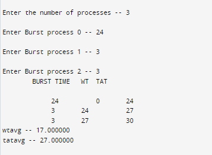
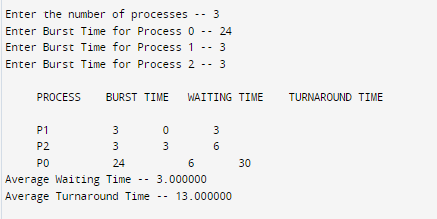
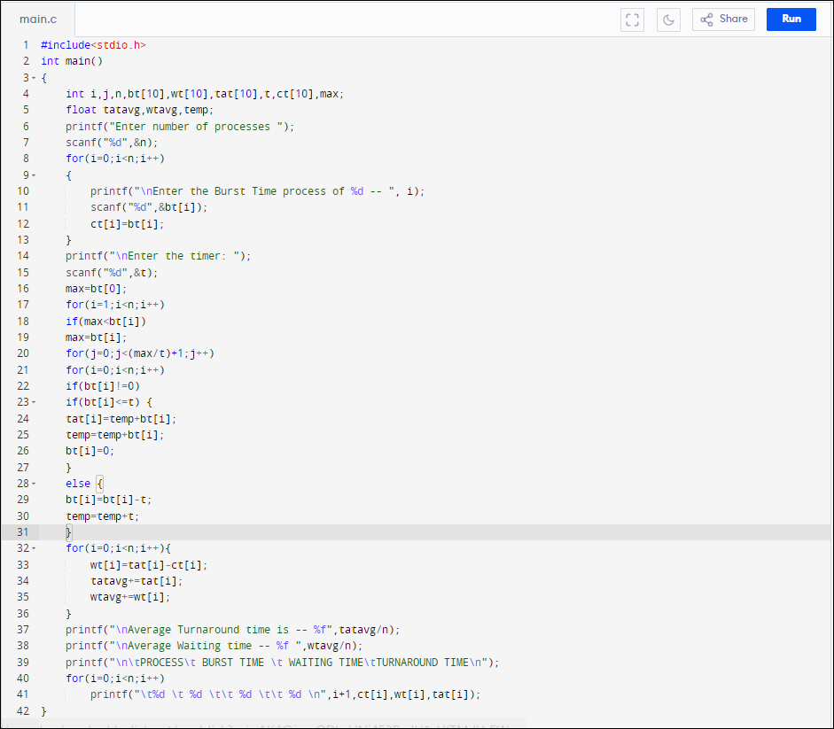
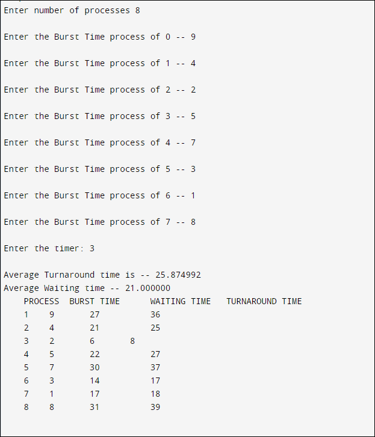
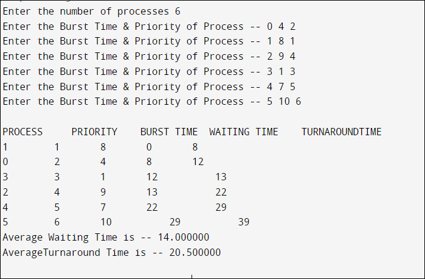

#FCFS 9a
#Program File

#Sample Output

#Tested Output

#SJF 9b
#Program File

#Sample Output

#Tested Output

#RoundRobin 9c
#Program File

#Sample Output

#Tested Output

#Priority 9d
#Program File

#Sample Output

#Tested Output

